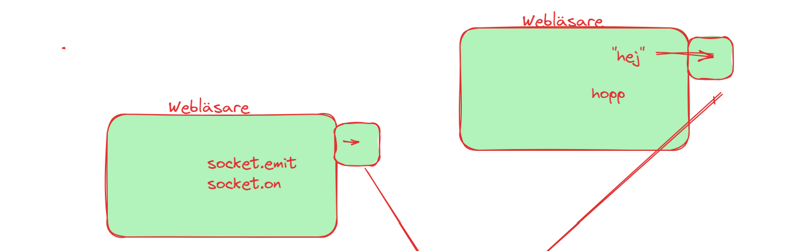

# Detta är rubriken

## Detta är rubrik2

detta är ett **viktigt** projekt

## Detta är en annan rubrik

Kolla vilken fin kod jag har gjort

```
const app: Express = express();
const port = process.env.PORT || 3000;

app.set('view engine', 'ejs')


app.get("/allproducts", async (req: Request, res: Response) => {
    const prods = await findAllProducts()
    res.json(prods);
  });

```

Jag har lärt mig allt jag kan från [Stefan](https://systementor.se) såklart!


### Här ser du vad fin applikationen är



## Coola grejor
- [x] Bra design
- [ ] Bra färger (inte än)
- [x] Add delight to the experience when all tasks are complete


test <ins>detta</ins> är *ett* vuikltigt

